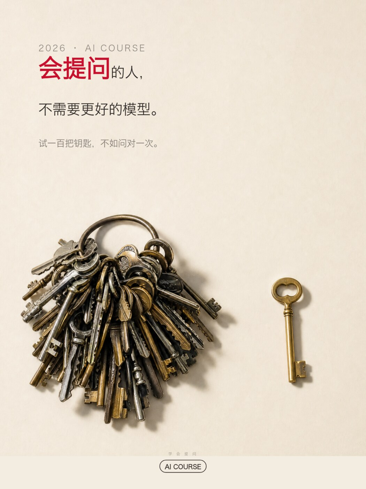
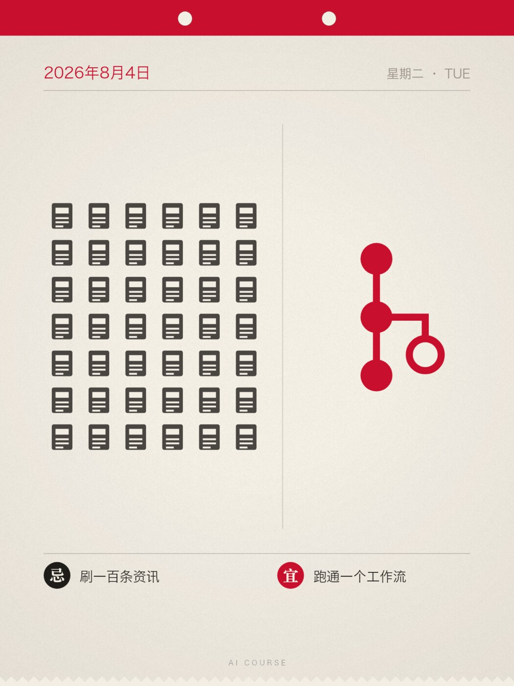
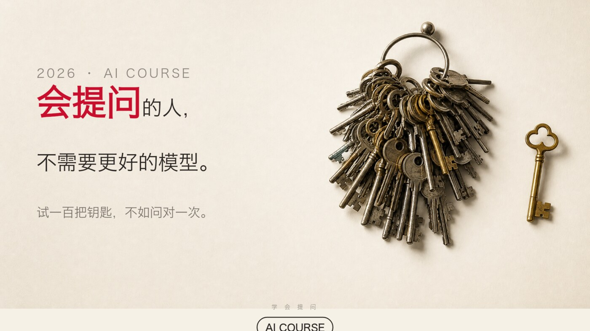

# xiaoma-durex-copywriter

> 一个 Claude Code / Claude.ai Skill：用杜蕾斯黄金期（2011–2017，环时互动操盘）那套**「双层语义 + 留白」**的方法，产出文案与海报。

不是教你写黄段子。**污只是那个品类的表层材料**，真正可迁移的是一套制造「我懂了」瞬间的机制——把材料换成 AI 课程、职场、理财、健身，机制照样成立。

<p align="center">
  
  
</p>

---

## 核心机制：双层语义

一句合格的杜蕾斯式文案，必须**同时成立于两个语境**：

| 层 | 内容 |
|---|---|
| **表层** | 热点 / 节日 / 日常场景本身，字面读得通 |
| **里层** | 品牌 / 产品 / 你要卖的东西 |

作者**只写表层**，里层由读者自己跳过去。那一下跳跃产生的快感，就是传播动力。

> 「光大是不行的」——表层：光大银行乌龙。里层：不行。
> 「最快的男人并不是最好的，坚持到底才是真正强大的男人」——表层：刘翔。里层：持久。
> 「今晚早回家」——中元节。什么都没说，什么都说了。

**铁律：点破即死。** 只要在文案里解释了里层，这条就废了。

---

## 它会做什么

Skill 触发后走一条**交互式流程**，不会闷头给你一版就完事：

```
Step 0  补槽位 —— 用默认值，不用提问
        只有「卖什么」完全无法推断时才反问；其余缺失一律写成明示假设
        「我按『发朋友圈、面向老会员』来做，不对直接说」

Step 1  给 3–5 个方案让你选 —— 强制走不同公式、不同主体类型、不同配色
        不允许是同一个想法的三个变体

Step 2  唯一一次提问 —— 把「选方案」和「选比例」合并成一轮，都可多选

Step 3  出文案 —— 默认短文案（≤12 字）；长文案要了才出
        海报上永远只放短的

Step 4  出图 —— AI 出静物主体图层 + 代码排版
```

> **为什么默认不提问**：模型天然倾向多问，而每轮提问都在消耗用户耐心。用户找你是要东西的，不是来做问卷的。**一个带明示假设的具体方案，比三个精准的问题更有用**——用户看到具体的东西才知道自己想要什么。方案本身就是最好的提问方式。
>
> 这条不是拍脑袋定的，是**跑评测跑出来的**：第一轮测试里 Skill 在只缺一个槽位时仍然停下来提问，还自己发明了第四槽位之外的新问题。详见 [`evals/`](evals/)。

---

## 安装

```bash
git clone https://github.com/crawfordxx/xiaoma-durex-copywriter.git \
  ~/.claude/skills/xiaoma-durex-copywriter
```

Claude Code 下次启动即可用。触发词：「写个文案」「借势热点」「节日海报」「想句 slogan」「课程怎么推」「像杜蕾斯那样写」。

出图部分需要（可选）：

```bash
npm i @napi-rs/canvas      # Canvas 排版
pip install playwright     # HTML 排版（二选一即可）
```

---

## 八个文案公式

完整拆解与非成人品类的迁移示范见 [`references/copy-formulas.md`](references/copy-formulas.md)。

| # | 公式 | 杜蕾斯原例 | 迁移到 AI 课程 |
|---|---|---|---|
| 1 | 谐音置换 | 「杜 du 饿了」 | 「不 AI 则退」 |
| 2 | 数字双关 | 「先来 7 次」 | 「3 小时，换回你未来 3 年的加班」 |
| 3 | 词义劫持 | 「深耕细作」 | 「不是 AI 有幻觉，是你以为你会用它」 |
| 4 | 场景移植 | 「洗衣机说……」 | 「咖啡杯说：以前他一晚续我五次」 |
| 5 | 拆字重组 | 「『日』字有多长」 | 「智 = 知 + 日」 |
| 6 | 对仗 / 宜忌 | 「堵在路上 不如堵在床上」 | 「宜 动手实操　忌 收藏吃灰」 |
| 7 | 诗歌体 | 三段景物 + 一句落点 | （长文案专用） |
| 8 | **反向克制** | 中元节「今晚早回家」 | 「工具会淘汰工具，不会淘汰想清楚的人」 |

公式 8 最高级：**在所有人都期待你耍花活的时候不耍**。一个一直很皮的品牌突然正经，人格厚度瞬间建立。全年用不超过 5 次。

---

## 视觉系统

从 **260 张原始海报**实测拆解而来，详见 [`references/visual-system.md`](references/visual-system.md)。

### 主体判断树

```
有实体产品吗？
├─ 有 → 产品能成为隐喻本体吗？
│   ├─ 能 → 【产品主体】居中，占画面 15–35%，纯色背景，强投影
│   └─ 不能 → 产品退到角标（5–10%），画面让给道具
└─ 没有（课程 / 知识 / 服务）→
    ├─ 【道具主体】← 最高频，也最适合无产品场景
    │   ⚠️「没有实体产品」≠「画面要空」
    │      杜蕾斯的道具是有质感的实拍静物，不是一根线
    └─ 【纯字体主体】大字即画面
```

实测占比：产品 ~30% / **道具 ~40%** / 纯字体 ~30%。真人几乎不用，用也只出手、腿、剪影。

### 六套配色

| 名称 | 主色 | 用于 |
|---|---|---|
| 品牌红 | `#E2001A` + 纯白 | 节庆、宣言、周年、态度 |
| 深夜蓝 | `#16233F` `#0E1A2E` | 克制、高级、夜、思考 |
| 影棚黑 | `#000000` + 单点暖光 | 电影感、悬念、单品特写 |
| 粉渐变 | `#FCEDF1` → `#E8558F` | 情人节、女性向、年度报告 |
| 宣纸暖白 | `#F1EBE0` + 朱红 `#C8102E` | 静物、节气、中国风、日历 |
| 借势撞色 | 对方品牌色 | 联名、影视 / 球队 / 科技借势 |

### 排版铁律

- 文案在**上 1/3 或左上**，左对齐；下 1/3 留白或放主体
- 正文 ≈ 画面宽度 3.5%–4.5%；**关键词放大 1.65–1.75 倍并染品牌色**，其余全部同字号同色
- 眉题为正文 0.6 倍，灰色，带字距
- **Logo 恒定底部居中，且必须落在空白处**——主体图不许压到它
- 留白率 ≥ 50%。挤 = 廉价

### 字体 → [`references/typography.md`](references/typography.md)

**两条最关键的：**

**1. 借势时字体跟着借势对象走，不跟品牌走。** 这是杜蕾斯字体用法里最容易被忽略的一条——仿 iPhone 发布会就用苹方/SF 复刻，仿电影海报就用做旧衬线 + 手写 script，仿 CS:GO 就直接嵌进游戏 UI，仿文革宣传画就用老宋竖排。读者对这些视觉语言有肌肉记忆，**字体一出来，双层语义的「表层」就已经完成了**，文案只需负责里层。

**2. ⚠️ 中文字体侵权是国内营销物料最高频的法律风险。** 微软雅黑、苹方、方正系列、汉仪系列都需商业授权，**「电脑里有」≠「能商用」**——方正、汉仪都有专门的维权团队，单张海报索赔常在数千到数万元。

参考文件里给了八类字体（黑体/粗黑/宋体/楷书/手写/英文无衬线/Script/数字等宽）的**可免费商用替代**，以及一份授权红线清单。拿不准就用**思源黑体 + 思源宋体**（SIL OFL，可商用可修改），标题要力量感用**得意黑 Smiley Sans**。

---

## 出图管线：为什么不让 AI 把字写进图里

AI 生图模型渲染中文仍会**错字、缺笔画、字形崩坏**，且不可控。而这套视觉的命门恰恰是**精确排版**。

所以分层：

```
① AI 图像模型  →  只出【静物道具 / 背景质感】，提示词必写 NO text
② 代码排版     →  承担全部文字（Canvas 或 HTML/CSS）
③ 精确输出     →  五种画幅
```

好处：中文永不出错、关键词染色和字号倍率精确可控、**改文案只改一行代码，静物图复用不用重新出图**。

排版方案怎么选，详见 [`references/production.md`](references/production.md)：

| 方案 | 何时用 |
|---|---|
| **Canvas**（`@napi-rs/canvas`） | 默认；尤其**图形阵列**（撕历体那种满屏图标矩阵）程序化生成远胜手摆 |
| **HTML/CSS + Playwright** | 复杂版式、想所见即所得地调 |
| **Satori + resvg** | 服务端批量、不想装浏览器 |

---

## 示例

`examples/output/` 是用本 Skill 实做的一套「AI 课程」海报，五种比例：

主文案 **「会提问的人，不需要更好的模型。」**
副标 **「试一百把钥匙，不如问对一次。」**

道具选钥匙——一大串杂乱的 vs 一把对的，同构那句副标，而且钥匙 = 打开。

| 3:4 | 1:1 | 16:9 |
|---|---|---|
|  |  |  |

`examples/durex-reference/` 是 24 张杜蕾斯原始海报的低分辨率样本，供对照学习排版规律用（见下方版权声明）。

---

## 目录结构

```
.
├── SKILL.md                      # 主文件：机制、工作流、公式速查、边界
├── references/
│   ├── corpus.md                 # 语料库（34 个来源 / 260 张海报）
│   ├── copy-formulas.md          # 8 个公式详解 + 迁移模板
│   ├── visual-system.md          # 视觉系统完整规范
│   ├── typography.md             # 字体选型集 + 授权红线
│   ├── ratios.md                 # 五种画幅构图规范
│   ├── production.md             # 出图管线与方案选型
│   └── other-uses.md             # 迁移场景
├── evals/                        # 测试用例与断言（Skill 的行为是被测过的）
├── assets/
│   ├── compose_canvas.js         # Canvas 合成（含签名避让）
│   ├── compose_example.py        # HTML/Playwright 合成
│   └── gen_hero_example.py       # 静物图生成
└── examples/
    ├── output/                   # 本 Skill 实做的成品
    └── durex-reference/          # 杜蕾斯原图低分样本
```

---

## 还能用在哪

见 [`references/other-uses.md`](references/other-uses.md)：自媒体标题与封面、知识付费、B 端 SaaS（拿行业黑话做词义劫持）、电商详情页（让商品旁边的物件开口）、招聘 JD、个人 IP、节气日历型系列资产。

也写了**不适合迁移**的场景：强合规品类、危机公关、面向低网感人群、B2B 大宗采购。

---

## 有所为有所不为

杜蕾斯 2017 年「419 联名」翻车、随后失去环时互动，根因就是越了第 3 条。Skill 里把这五条写成硬边界：

1. 不碰灾难、事故、死亡、疾病 —— 除非是明确的公益立场
2. 不物化女性
3. **不对具体真人做性暗示**，尤其不涉及未成年
4. 不蹭悲情热点
5. 迁移到非成人品类时，双关的里层应指向**产品价值**，不是荤梗

---

## 版权与免责

- `examples/durex-reference/` 中的海报**版权归杜蕾斯 / 利洁时集团（Reckitt Benckiser）所有**。此处仅收录 24 张、已压至 800px 以内的低分辨率样本，用于广告创意方法的**学习与评论**，不用于任何商业用途。
- 语料与案例整理自数英网、优设网、广告门、梅花网、知乎等公开来源，**版权归原作者及原发布平台所有**。
- 本仓库与杜蕾斯 / 利洁时集团**无任何隶属或合作关系**。
- 如权利人认为不妥，请提 issue，收到后立即移除。
- 代码部分（`assets/`）以 MIT 协议提供。

---

## 致谢

方法论源头是**环时互动**与 **金鹏远** 团队 2011–2017 年的作品。他们在 6 年里发了 16938 条微博，日均 8 条——**持续高质量产出**才是这一切的真正前提，公式只是结果。
