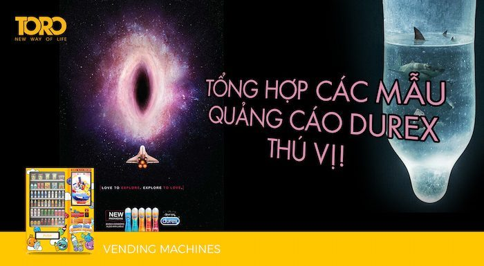
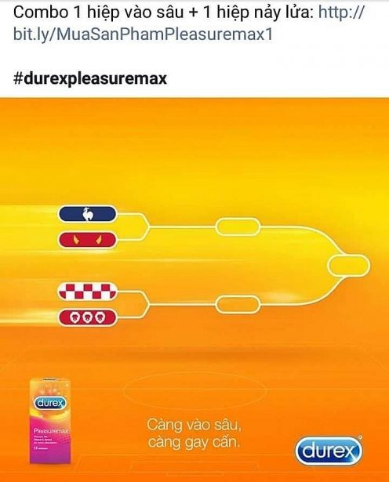
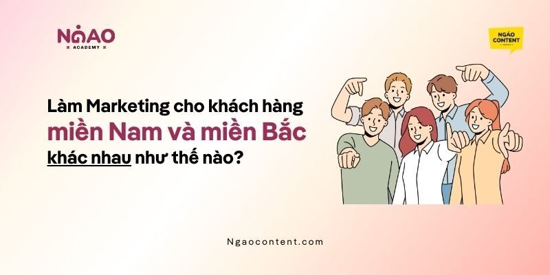
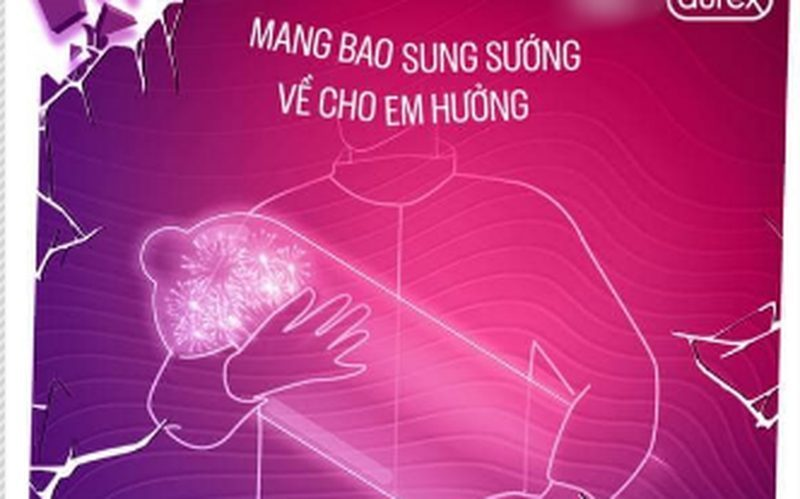

# xiaoma-durex-copywriter

**Tiếng Việt** · [English](README.cn.md)

> Skill cho Claude Code / Claude.ai: viết copy và dựng poster theo công thức **"hai tầng nghĩa + khoảng trắng"** — bộ công thức làm nên thời hoàng kim của Durex trên mạng xã hội Trung Quốc (2011–2017, dưới bàn tay agency Environment Interactive).

Durex ghi điểm không phải vì dám "mặn" — mặn chỉ là chất liệu của ngành hàng. Cái thật sự đáng học, và là cái skill này đóng gói lại, là **cơ chế tạo ra khoảnh khắc "à, hiểu rồi!"** khiến người xem tự tay bấm share. Đổi chất liệu sang khoá học AI, chuyện công sở, tài chính cá nhân hay phòng gym — cơ chế vẫn chạy mượt. Và đây cũng chính là bộ công thức đứng sau cái danh mà dân marketing Việt đặt cho Durex: **"thánh bắt trend"**.

<p align="center">
  
  
</p>

> **Về ngôn ngữ.** Phương pháp gốc sinh ra bằng tiếng Trung, kho ngữ liệu cũng là tiếng Trung. Các câu gốc được giữ nguyên kèm phần diễn giải tiếng Việt — vì **cái chơi chữ chính là hiện vật**, dịch xong là mất sạch cái đáng học. Phần phân tích viết bằng tiếng Việt; còn ví dụ chuyển ngành thì viết lại hẳn thành copy chạy được trong ngôn ngữ đích, không dịch word-by-word.
>
> **Riêng bản tiếng Việt có thêm một phần độc quyền:** [Durex tại thị trường Việt Nam](#durex-tại-thị-trường-việt-nam) — kho câu copy tiếng Việt có thật ngoài đời, cách chuyển tám công thức sang tiếng Việt, lịch bắt trend thị trường Việt và những lằn ranh riêng phải nhớ. Bản tiếng Anh không có phần này.

---

## Hai tầng nghĩa

Một câu copy kiểu Durex đạt chuẩn phải **đứng vững đồng thời trong hai ngữ cảnh**.

| Tầng nghĩa | Nội dung |
|---|---|
| **Tầng nổi** | Bản thân trend / ngày lễ / cảnh đời thường — đọc theo nghĩa đen vẫn thông |
| **Tầng chìm** | Thương hiệu / sản phẩm / thứ bạn đang bán |

Người viết **chỉ viết tầng nổi**; tầng chìm để độc giả tự nhảy sang. Cú nhảy đó tạo ra khoái cảm, và khoái cảm đó chính là động lực lan truyền.

Ngày Ngân hàng Everbright Trung Quốc bị lỗi giao dịch, Durex đăng 「光大是不行的」— "chỉ mỗi Everbright thì không ăn thua", trong đó tên ngân hàng đọc theo nghĩa đen là "chỉ to". Khi vận động viên rào Lưu Tường ngã, Durex đặt "nhanh" cạnh "bền" và trên bề mặt chỉ nói về vận động viên. Dịp lễ Vu Lan, hãng chỉ viết năm chữ: 「今晚早回家」— "tối nay về nhà sớm".

Toàn bộ tinh thần gói trong bốn chữ: **gợi mà không phô**.

**Nói toạc ra là chết — đó là luật sắt.** Chỉ cần câu copy giải thích tầng chìm, câu đó vứt đi.

---

## Skill này làm gì

Khi được kích hoạt, skill chạy một **quy trình tương tác**, chứ không phải quăng cho bạn một bản rồi coi như xong.

```
Bước 0  Điền các ô thông tin — bằng giá trị mặc định, không phải bằng câu hỏi
        Chỉ "bán cái gì" mới đáng hỏi khi không thể suy ra;
        mọi chỗ thiếu khác đều viết thành giả định nói rõ
        "Tôi làm theo hướng 'đăng lên trang cá nhân, nhắm tới khách cũ' — sai thì bảo tôi"

Bước 1  Đưa 3–5 phương án để chọn — bắt buộc khác công thức, khác loại chủ thể, khác bảng màu
        Không được phép là ba biến thể của cùng một ý

Bước 2  Câu hỏi duy nhất — gộp "chọn phương án" và "chọn tỷ lệ" vào một lượt,
        cả hai đều cho chọn nhiều

Bước 3  Viết copy — mặc định copy ngắn, tức headline trên poster
        (≤12 ký tự Hán, ~8 từ tiếng Anh); copy dài (body copy) chỉ khi
        được yêu cầu. Trên poster luôn chỉ đặt copy ngắn

Bước 4  Ra hình — AI dựng lớp chủ thể tĩnh vật, code lo phần dàn chữ
```

> **Vì sao mặc định là không hỏi.** Mô hình có thiên hướng hỏi nhiều, mà mỗi lượt hỏi lại tiêu bớt kiên nhẫn của người dùng. Người dùng tìm bạn để lấy sản phẩm, không phải để điền khảo sát. **Một phương án cụ thể kèm giả định nói rõ có ích hơn ba câu hỏi chính xác**, bởi người dùng chỉ biết mình muốn gì khi nhìn thấy thứ cụ thể. Bản thân phương án chính là cách hỏi tốt nhất.
>
> Quy tắc này ra đời từ việc chạy eval. Vòng test đầu tiên, skill dừng lại hỏi ngay cả khi chỉ thiếu một ô, và còn tự nghĩ ra bốn câu hỏi nằm ngoài bốn ô đã định. Xem [`evals/`](evals/).

---

## Cài đặt

```bash
git clone https://github.com/quanglewin/xiaoma-durex-copywriter.git \
  ~/.claude/skills/xiaoma-durex-copywriter
```

Có hiệu lực ở lần khởi động Claude Code kế tiếp. Cụm từ kích hoạt: "viết cho tôi ít copy", "bắt trend này", "poster ngày lễ", "nghĩ giúp câu slogan", "khoá học này quảng bá sao", "viết kiểu Durex ấy".

Phần dựng hình thì cài khi cần.

```bash
npm i @napi-rs/canvas      # dàn chữ bằng Canvas
pip install playwright     # dàn chữ bằng HTML (chọn một trong hai là đủ)
```

---

## Tám công thức copy

Phân tích đầy đủ, kèm ví dụ chuyển sang ngành không phải người lớn, nằm ở [`references/copy-formulas.md`](references/copy-formulas.md).

| # | Công thức | Bản gốc Durex | Chuyển sang một khoá học AI |
|---|---|---|---|
| 1 | Chơi chữ đồng âm | 「杜du饿了」(Baidu Waimai × Ele.me) | "Prompt and circumstance" |
| 2 | Chơi chữ bằng số | 「先来 7 次」("làm 7 lần trước đã") | "3 giờ bây giờ đổi lại 3 năm tăng ca" |
| 3 | Bẻ lái nghĩa | 「深耕细作」("thâm canh tỉ mỉ") | "Deep learning, shallow usage" |
| 4 | Cho đồ vật lên tiếng | "Máy giặt nói rằng…" | "Cái cốc cà phê nói: hồi trước mỗi đêm anh ấy rót đầy tôi năm lần" |
| 5 | Chiết tự | 「『日』字有多长」("chữ 日 dài bao nhiêu") | 智 = 知 + 日 — **chỉ dùng được trong tiếng Trung** |
| 6 | Câu đối / nên–kiêng | 「堵在路上 不如堵在床上」("kẹt trên giường còn hơn kẹt ngoài đường") | "Nên: bắt tay làm. Kiêng: lưu về để đó" |
| 7 | Thể thơ | Ba khổ tả cảnh + một câu hạ cánh | (chỉ dùng cho copy dài) |
| 8 | **Kiềm chế ngược** | Lễ Vu Lan: 「今晚早回家」("tối nay về nhà sớm") | "Công cụ thay thế công cụ. Nó không thay thế người đã nghĩ thông" |

Công thức 8 là đẳng cấp cao nhất: **không diễn trò đúng lúc ai cũng chờ bạn diễn trò**. Một thương hiệu bỡn cợt suốt năm bỗng nghiêm túc thì chiều sâu nhân cách được dựng lên lập tức. Không quá 5 lần mỗi năm.

---

## Durex tại thị trường Việt Nam

Phương pháp ở trên được đúc từ ngữ liệu tiếng Trung. Nhưng **chính cơ chế đó đã chạy bằng tiếng Việt suốt hơn một thập kỷ** — và chạy tốt tới mức dân marketing Việt đặt cho Durex biệt danh "thánh bắt trend". Phần này là kho ngữ liệu và bối cảnh thị trường Việt Nam, để bạn đối chiếu khi làm việc bằng tiếng Việt.

> **Về độ chính xác.** Các câu copy dưới đây được trích từ báo chí và các bài phân tích marketing tiếng Việt (nguồn liệt kê ở cuối phần). Bài đăng gốc trên fanpage có thể khác đôi chút về dấu câu hoặc cách xuống dòng. Dùng chúng để học **cơ chế**, đừng chép lại.

---

### Vì sao hai tầng nghĩa ở Việt Nam là điều kiện sống còn, không phải lựa chọn phong cách

Ở Trung Quốc, hai tầng nghĩa là một chiến thuật hay. Ở Việt Nam, nó gần như là **cách duy nhất còn lại**.

- **Kênh truyền thống gần như đóng.** Quảng cáo bao cao su rất khó lên TV, báo in hay OOH đại chúng. Toàn bộ sức nặng truyền thông dồn vào social — nơi thương hiệu tự làm chủ nội dung.
- **"Thuần phong mỹ tục" là một điều khoản pháp lý thật**, không chỉ là chuyện gu thẩm mỹ. Nội dung tục lộ liễu không chỉ bị chê — nó bị gỡ và bị phạt. Nên **tầng chìm bắt buộc phải nằm trong đầu người đọc, không được nằm trên mặt giấy**.
- **Rào cản là ngượng, không phải giá.** Tỷ lệ thâm nhập của bao cao su tại Việt Nam được ghi nhận ở mức rất thấp — quanh 19%. Vấn đề không nằm ở chỗ người ta không mua nổi, mà ở chỗ người ta ngại nhắc tới. Tiếng cười là cách rẻ nhất để tháo cái ngượng đó.

Ba ràng buộc này ép ra đúng cái công thức trong SKILL.md: **viết tầng nổi thật sạch, để tầng chìm cho người đọc tự nhảy sang.**

### Ai đứng sau

| | |
|---|---|
| Chủ thương hiệu | Reckitt Benckiser (mua lại Durex năm 2010) — Durex là một trong các Powerbrand của tập đoàn |
| Phía client tại VN | Đội Digital Marketing của Reckitt Benckiser Health Vietnam |
| Agency | **Isobar Vietnam** (Dentsu Aegis Network) — ASIAD 2018, U23 Việt Nam · **MSL Group** — World Cup 2018 · **Vietcetera** — chuỗi nội dung "Cởi Mở" |
| Vị thế thị trường | Dẫn đầu thị phần bao cao su tại Việt Nam, trên Sagami và OK, trong một thị trường có hơn 100 nhãn |

Thông điệp toàn cầu *Love Sex Confidently* được nội địa hoá thành **hai trục**:

- **"Yêu Vô Lo"** — trục bắt trend trên Facebook/TikTok, nhiệm vụ là *xoá cái ngượng*.
- **"Cởi Mở"** — trục kiến thức: podcast/talkshow giáo dục giới tính làm cùng Vietcetera từ 2020, đã qua mùa 3, có bản Unitour đi các trường đại học, cùng dàn KOL Huỳnh Lập, Trang Chuối, Tạ Quốc Kỳ Nam, Thùy Minh. Phim ngắn **"Chạm Không Đỉnh"** vượt 1 triệu view.

Ngoài ra còn có **(DUREX)RED** — chiến dịch phòng chống HIV/AIDS, phát 10.000 bao cao su ra cộng đồng; và **Durex Jeans**, đạt hơn 80% SOV cùng độ phủ trên 70% hệ thống bán lẻ chỉ sau 2 tháng ra mắt.

> **Đọc kỹ cấu trúc này.** Trục đùa và trục nghiêm túc **tách bạch**, và trục nghiêm túc mới là trục dựng nhân cách thương hiệu. Đây chính là công thức 8 (kiềm chế ngược) được tổ chức thành cả một tuyến nội dung, chứ không chỉ là vài bài đăng lẻ trong năm.

---

### Kho ngữ liệu Việt Nam

> Tư liệu hình đối chiếu và nguồn cho từng mẫu dưới đây nằm ở [`examples/durex-vietnam-reference/`](examples/durex-vietnam-reference/).

| Hình ảnh | Bối cảnh | Câu copy | Cơ chế |
|---|---|---|---|
|  | Vòng loại World Cup 2022, Việt Nam dẫn đầu bảng G; thủ môn Đặng Văn Lâm cản phạt đền của Thái Lan | **「Độc chiếm đỉnh G!」** kèm **「Cản phá như Lâm」** | Công thức 1 + 3. "Bảng G" đọc theo nghĩa đen là bảng đấu; "cản phá" là thuật ngữ bóng đá chuẩn. **Cả hai tầng nổi đều đúng 100% về mặt thể thao** — không một chữ nào phải giải thích |
|  | World Cup 2018, Croatia lần đầu vào chung kết (poster ra trong 24 giờ) | **「Lần đầu vào sâu」** | Công thức 3 — bẻ lái nghĩa. "Vào sâu" là cách nói giải đấu hoàn toàn bình thường |
|  | World Cup 2018, Anh thắng Panama 6–1 (poster ra sau 1 tiếng) | **「Cứu triệu bàn thua trông thấy, mỗi ngày」** | Bẻ lái thành ngữ "cứu một bàn thua trông thấy" + công thức 2 (đổi *một* thành *triệu*) |
|  | World Cup 2018, nói về diễn tiến trận đấu | **「1 hiệp vào sâu + 1 hiệp nảy lửa」**, **「càng vào sâu, càng gay cấn」** | Công thức 2 + 3, đóng gói theo kiểu "combo" |
|  | ASIAD 2018, Olympic Việt Nam thua trận tranh huy chương đồng | **「Đồng nào bằng đồng ngẩng cao đầu」** | Công thức 8 — **không đùa đúng lúc ai cũng chờ đùa**. Đây là bài an ủi, tầng chìm gần như bằng không. Cũng là bài dựng nhân cách thương hiệu mạnh nhất trong cả loạt |
|  | Tết Nguyên đán, tục khai bút đầu năm | **「Nắp đậy vừa vặn, mực căng không tràn」** | Công thức 4 — cho đồ vật lên tiếng. Bút và mực gánh toàn bộ ẩn dụ; sản phẩm không xuất hiện một chữ |
|  | Trend nhạc "Mang tiền về cho mẹ" (Đen Vâu, 1/2022 — gần 35 triệu view YouTube trong 2 tuần) | **「Mang bao sung sướng về cho em hưởng」** | Nhại cấu trúc lời hát + đồng âm **"bao"** (bao nhiêu / bao cao su). Bắt đúng cửa sổ trend đang nóng nhất |
|  | Valentine | **「Valenthai」** đặt cạnh que thử thai hai vạch — thông điệp "vui 2 người, đừng hối hận 2 vạch" | Ghép từ (Valentine + thai) + công thức 2 (hai vạch). Tầng nổi là ngày lễ, tầng chìm là hậu quả |
|  | Tàu Ever Given kẹt kênh đào Suez, 3/2021 | **「Hãy luôn bảo vệ hàng của bạn」** | Đồng âm/đa nghĩa **"hàng"** (hàng hoá / tiếng lóng). Sự kiện toàn cầu, câu chữ thuần Việt |
|  | Hội nghị thượng đỉnh Mỹ – Triều tại Hà Nội, 2/2019 | Hình hai chiếc bao bọc nòng súng — **「Chặn đứng đạn lạc, vì hoà bình」** | Ẩn dụ thị giác gánh tầng chìm, câu chữ ở lại hoàn toàn trong tầng nổi chính luận. Bài liều nhất trong loạt, và cũng là bài cho thấy lằn ranh nằm ở đâu |

**Đọc ngang bảng này sẽ thấy một điều.** Không một câu nào trong số đó nhắc tới sản phẩm. Không một câu nào cần chú thích. Và mọi câu đều **đứng vững nếu đọc theo nghĩa đen** — đó chính là bài kiểm tra ở đầu tài liệu này, được vượt qua bằng tiếng Việt.

**Về tốc độ.** Croatia vào chung kết: 24 giờ. Anh thắng Panama: 1 tiếng. Đây là cùng một kỷ luật sản lượng như 8 bài/ngày ở giai đoạn hoàng kim — **cửa sổ trend ở Việt Nam thường chỉ tính bằng giờ**, và một câu hay đăng muộn hai ngày thì bằng không.

---

### Chuyển tám công thức sang tiếng Việt

| # | Công thức | Trạng thái trong tiếng Việt | Ví dụ đã chạy thật |
|---|---|---|---|
| 1 | Chơi chữ đồng âm | ★ **Mạnh hơn cả tiếng Trung.** Tiếng Việt đơn âm tiết, kho từ đa nghĩa dày: *bao, hàng, vào, sâu, đỉnh, chất, căng, nước, mềm, cứng* | "Hãy luôn bảo vệ **hàng** của bạn" |
| 2 | Chơi chữ bằng số | ★ Chạy y nguyên | "**2 vạch**", "**1 hiệp** vào sâu", "cứu **triệu** bàn thua" |
| 3 | Bẻ lái nghĩa | ★★ **Lợi thế lớn nhất.** Kho thành ngữ – tục ngữ – ca dao Việt cực dày, ai cũng thuộc, nên bẻ một chữ là cả câu bật lên | "Cứu **triệu** bàn thua trông thấy" |
| 4 | Cho đồ vật lên tiếng | ★ Chạy y nguyên | "Nắp đậy vừa vặn, mực căng không tràn" |
| 5 | Chiết tự | ✗ **Không dùng được** — chữ Quốc ngữ không có bộ thủ. Xem ba cơ chế thay thế bên dưới | — |
| 6 | Câu đối / nên–kiêng | ★★ **Vốn là format bản địa.** Câu đối Tết, lịch vạn niên, "tuổi hợp – tuổi khắc", "nên làm – kiêng làm" đều là thứ người Việt đọc từ bé | — |
| 7 | Thể thơ | ★★ **Lục bát, vè, rap.** Việt Nam có lợi thế hơn: rap Việt là nguồn trend chảy liên tục, và lục bát thì ai cũng bắt được nhịp | Nhại lời "Mang tiền về cho mẹ" |
| 8 | Kiềm chế ngược | ★ Chạy y nguyên, và **quan trọng hơn** ở Việt Nam vì lịch có nhiều ngày trang nghiêm | "Đồng nào bằng đồng ngẩng cao đầu" |

#### Ba cơ chế bản địa thay cho chiết tự

**a. Nói lái.** Đây là đặc sản chơi chữ của tiếng Việt, mạnh ngang chiết tự trong tiếng Trung. ⚠️ **Nhưng đây cũng là cái bẫy lớn nhất.** Nói lái rơi vào tục tĩu trắng trợn chỉ trong một bước, và lúc đó là vi phạm thẳng luật "gợi mà không phô" — chưa kể rủi ro bị gỡ bài. **Luật dùng: để người đọc tự lái, đừng lái sẵn cho họ.** Nếu câu copy đã lái xong nghĩa tục ra mặt chữ thì vứt đi.

**b. Dấu thanh.** Thêm, bớt hoặc đổi dấu tạo ra nghĩa thứ hai. Viết không dấu vốn là văn hoá chat bản địa, nên trò này đọc rất tự nhiên chứ không có vẻ cố tình.

**c. Hán–Việt đối lại thuần Việt.** Cùng một khái niệm có hai tầng đăng ký ngôn ngữ — một trang trọng, một đời thường. Đặt tầng trang trọng lên mặt chữ, người đọc tự dịch ngược về tầng đời thường. Đây là phiên bản tiếng Việt của **giọng kiềm chế**: chữ càng nghiêm, cú nhảy càng mạnh.

#### Một chỉnh sửa về độ dài

Luật gốc là **≤12 ký tự Hán**. Tiếng Việt loãng hơn: **6–10 từ, tương đương 25–40 ký tự** cho headline trên poster. Quá ngưỡng đó là chữ trên poster bắt đầu nhỏ lại, và luật "từ khoá phóng 1,65–1,75 lần" sẽ hỏng.

---

### Lịch trend Việt Nam

Lịch của thị trường Trung Quốc trong `references/corpus.md` **không dùng lại được**. Đây là lịch cần thay vào.

| Nhóm | Các mốc |
|---|---|
| **Tết và lịch âm** | Tết Nguyên đán (khai bút, lì xì, mùng 1 – mùng 3), Rằm tháng Giêng, Tết Hàn thực, Tết Đoan Ngọ, Vu Lan, Trung thu, ông Công ông Táo |
| **Ngày lễ dương lịch** | Valentine 14/2, 8/3, 30/4 – 1/5, 1/6, 20/10, Halloween, 20/11, Black Friday, Giáng sinh, Tết dương lịch |
| **Ngày trang nghiêm — vùng của công thức 8** | Giỗ tổ Hùng Vương (10/3 âm), 27/7, Vu Lan, quốc tang, mùa bão lũ miền Trung |
| **Thể thao — nguồn trend mạnh nhất** | SEA Games, AFF Cup, vòng loại World Cup, U23 châu Á. **Bóng đá ở Việt Nam là sự kiện toàn dân**, cường độ vượt xa mọi hạng mục khác |
| **Giải trí** | Rap Việt và các show âm nhạc truyền hình, MV của các nghệ sĩ lớn (Đen Vâu, Sơn Tùng), phim Việt chiếu Tết, phim bộ đang hot |
| **Trend mạng** | Trend TikTok, meme, câu nói viral — vòng đời ngắn, thường **dưới 72 giờ** |

---

### Lằn ranh riêng của thị trường Việt

Năm lằn ranh cứng ở cuối tài liệu vẫn giữ nguyên. Thị trường Việt Nam **cộng thêm** các điều sau.

1. **"Thuần phong mỹ tục" là rủi ro pháp lý, không phải chuyện gu.** Nội dung tục lộ liễu bị gỡ và bị xử phạt. Đây là lý do kỹ thuật khiến tầng chìm phải nằm trong đầu người đọc.
2. **Không đụng vào chính trị, lãnh đạo, tôn giáo, chủ quyền.** Không có phiên bản "khéo" nào của việc này cả.
3. **Không đùa trong quốc tang, thiên tai, bão lũ, tai nạn.** Đây là lúc dùng công thức 8, hoặc im lặng.
4. **Nói lái tục là biên giới đỏ**, kể cả khi câu chữ trên mặt giấy vẫn "sạch".
5. **Với người thật — kể cả cầu thủ đang được cả nước tung hô — chỉ được ở tầng khen ngợi thành tích.** "Cản phá như Lâm" khen một pha cứu thua có thật; nó không ám chỉ tình dục vào cá nhân Đặng Văn Lâm. Khoảng cách giữa hai thứ đó rất hẹp, và vượt qua là mất thương hiệu.
6. **Bóng đá: khen, đừng giễu.** Đội thắng thì mừng, đội thua thì an ủi. Giễu đối thủ nước ngoài là con đường ngắn nhất tới một cuộc khủng hoảng ngoại giao trên mạng.

---

### Dùng phần này với skill như thế nào

**Không cần dặn gì thêm — kiến thức này đã được đóng gói vào skill.** Khi yêu cầu hoặc ngôn ngữ đầu ra là tiếng Việt, skill tự nạp [`references/vietnam-market.md`](references/vietnam-market.md): công thức 5 tự đổi sang nói lái / dấu thanh / Hán–Việt, headline theo ngưỡng 6–10 từ, lịch trend và lằn ranh dùng bản Việt Nam, font được kiểm tra dấu tiếng Việt trước khi chọn. Phần trong README này là bản đọc cho người; file reference kia là bản máy đọc khi chạy.

Và giữ nguyên bài kiểm tra cũ: **đọc câu copy theo đúng nghĩa đen — nếu nó vẫn là một câu hoàn chỉnh và hợp lý về sự kiện đang nói tới, câu đó đạt. Nếu phải giải thích, câu đó hỏng.**

### Nguồn tham khảo cho phần này

- [Những gương mặt đứng sau các bài viết "vạn người mê" trên Facebook của Durex Việt Nam](https://cafebiz.vn/nhung-guong-mat-dung-sau-cac-bai-viet-van-nguoi-me-tren-facebook-cua-durex-viet-nam-20191201094700625.chn) — CafeBiz
- [Durex Việt Nam: "Quảng cáo của chúng tôi khiêu khích, tinh nghịch nhưng vẫn trong khuôn khổ văn hóa Việt"](https://advertisingvietnam.com/article/durex-viet-nam-quang-cao-cua-chung-toi-khieu-khich-tinh-nghich-nhung-van-trong-khuon-kho-van-hoa-viet-l17340) — Advertising Vietnam
- [Nhìn lại 10 năm Durex mở khóa chuyện "yêu" tại Việt Nam](https://www.brandsvietnam.com/congdong/topic/336895-nhin-lai-10-nam-durex-mo-khoa-chuyen-yeu-tai-viet-nam) — Brands Vietnam
- [#Casestudy: Durex và hành trình "cởi mở" nội dung 18+ tại Việt Nam](https://theinfluencer.vn/casestudy-durex-va-hanh-trinh-coi-mo-noi-dung-18-tai-viet-nam) — The Influencer
- [Đến hẹn lại lên: Durex bắt trend "Mang tiền về cho mẹ"](https://cafef.vn/den-hen-lai-len-durex-bat-trend-mang-tien-ve-cho-me-choi-chu-chat-nhu-nuoc-cat-man-so-2-kho-ai-so-1-20220113142332687.chn) — CafeF
- [Chiêu marketing "đu trend" đỉnh cao của Durex: "Hãy luôn bảo vệ hàng của bạn" sau sự cố tàu Ever Given](https://cafebiz.vn/chieu-marketing-du-trend-dinh-cao-cua-durex-tung-thong-diep-hay-luon-bao-ve-hang-cua-ban-sau-su-co-tau-ever-given-20210329142703176.chn) — CafeBiz
- [Những chiêu quảng cáo "bắt trend" đỉnh cao của hãng sản xuất bao cao su Durex](https://24hmoney.vn/news/nhung-chieu-quang-cao-bat-trend-dinh-cao-cua-hang-san-xuat-bao-cao-su-durex-c2a884754.html) — 24hMoney
- [Những mẫu quảng cáo Durex độc đáo mùa World Cup 2018](https://adsplus.vn/blog/nhung-mau-quang-cao-durex-doc-dao-trong-world-cup-2018) — Adsplus
- [Bí kíp nhà vô địch World Social Media Cup — Durex](https://blog.tomorrowmarketers.org/bi-kip-nha-vo-dich-world-social-media-cup-durex/) — Tomorrow Marketers
- [Tại sao content Durex luôn đột phá & thu hút số đông khách hàng](https://ngaocontent.com/content-durex/) — Ngáo Content
- [Phân tích chiến lược Marketing của Durex tại Việt Nam](https://miccreative.vn/chien-luoc-marketing-cua-durex/) — MIC Creative
- [Vietcetera và Durex khởi động "Cởi Mở Đi Unitour"](https://www.brandsvietnam.com/congdong/topic/324592-vietcetera-va-durex-khoi-dong-coi-mo-di-unitour) — Brands Vietnam
- [Nóng bỏng thị trường bao cao su](https://m.nhipcaudautu.vn/kinh-doanh/nong-bong-thi-truong-bao-cao-su-3330115) — Nhịp cầu Đầu tư

---

## Hệ thống thị giác

Rút ngược ra từ **260 poster gốc**; quy chuẩn đầy đủ ở [`references/visual-system.md`](references/visual-system.md).

### Cây quyết định chủ thể

```
Có sản phẩm vật lý không?
├─ Có → bản thân sản phẩm có làm ẩn dụ được không?
│   ├─ Được → 【chủ thể là sản phẩm】đặt giữa, chiếm 15–35% khung hình,
│   │          nền trơn, đổ bóng mạnh
│   └─ Không → đẩy sản phẩm về góc (5–10%), nhường khung hình cho đạo cụ
└─ Không (khoá học / tri thức / dịch vụ) →
    ├─ 【chủ thể là đạo cụ】 ← hay dùng nhất, cũng hợp nhất khi không có sản phẩm
    │   ⚠️ "Không có sản phẩm vật lý" ≠ "khung hình phải trống".
    │      Đạo cụ của Durex là tĩnh vật chụp thật, có chất liệu, không phải một nét kẻ.
    └─ 【chủ thể là chữ】chữ lớn chính là hình
```

Tỷ lệ đo được: sản phẩm ~30% / **đạo cụ ~40%** / chữ ~30%. Gần như không dùng người thật; nếu có thì chỉ một bàn tay, đôi chân, hoặc bóng đổ.

### Sáu bảng màu

| Tên | Màu chính | Dùng cho |
|---|---|---|
| Đỏ thương hiệu | `#E2001A` + trắng tinh | Lễ hội, tuyên ngôn, kỷ niệm, thái độ |
| Xanh nửa đêm | `#16233F` `#0E1A2E` | Kiềm chế, sang, đêm, suy tư |
| Đen studio | `#000000` + một nguồn sáng ấm | Chất điện ảnh, hồi hộp, cận cảnh đơn sản phẩm |
| Hồng chuyển sắc | `#FCEDF1` → `#E8558F` | Valentine, hướng nữ, báo cáo cuối năm |
| Trắng ngà giấy dó | `#F1EBE0` + son `#C8102E` | Tĩnh vật, tiết khí, phong vị Trung Hoa, lịch |
| Mượn màu đối tượng | Dùng thẳng màu thương hiệu của bên kia | Collab; bắt trend phim / đội bóng / công nghệ |

### Luật sắt về dàn trang

- Copy nằm ở **1/3 trên hoặc góc trên bên trái**, căn trái; 1/3 dưới để trắng hoặc đặt chủ thể
- Cỡ chữ nội dung ≈ 3,5%–4,5% chiều rộng khung; **từ khoá phóng to 1,65–1,75 lần và tô màu thương hiệu**, phần còn lại đồng cỡ đồng màu
- Dòng eyebrow bằng 0,6 lần cỡ nội dung, màu xám, có giãn chữ
- **Logo cố định ở giữa đáy và phải nằm trên nền trống**; hình chủ thể không được đè lên
- Khoảng trắng (không gian âm) ≥ 50% khung hình. Chật = rẻ tiền

### Font chữ → [`references/typography.md`](references/typography.md)

**Hai điều quan trọng nhất.**

**1. Khi bắt trend (newsjacking), font chạy theo đối tượng bị bắt trend, không chạy theo thương hiệu.** Đây là phần hay bị bỏ sót nhất trong cách Durex dùng font. Nhái sự kiện iPhone thì dùng PingFang/SF; nhái poster phim thì dùng serif làm cũ kèm phụ đề viết tay; nhái CS:GO thì nhúng thẳng vào giao diện game; nhái tranh cổ động Cách mạng Văn hoá thì dùng Tống thể cũ xếp dọc. Độc giả có trí nhớ cơ bắp với những ngôn ngữ thị giác này — **font vừa hiện lên là tầng nổi đã xong**, câu copy chỉ còn lo tầng chìm.

**2. ⚠️ Vi phạm bản quyền font tiếng Trung là rủi ro pháp lý phổ biến nhất trong ấn phẩm marketing tại Trung Quốc.** Microsoft YaHei, PingFang, các bộ Founder (方正) và Hanyi (汉仪) đều cần giấy phép thương mại. **"Máy tôi có sẵn" ≠ "được dùng thương mại".** Founder và Hanyi đều có đội chuyên đi kiện, và mức đòi bồi thường cho một tấm poster thường từ vài nghìn tới vài chục nghìn tệ.

File tham chiếu liệt kê **các font thay thế miễn phí cho mục đích thương mại** thuộc tám nhóm (sans / sans đậm / serif / khải / viết tay / sans Latin / script / số & mono), kèm danh sách lằn ranh bản quyền. Không chắc thì dùng **Source Han Sans + Source Han Serif** (SIL OFL, được dùng thương mại và chỉnh sửa); tiêu đề cần lực thì dùng **Smiley Sans (得意黑)**.

---

## Vì sao không để AI viết chữ thẳng vào hình

Các mô hình sinh ảnh vẫn **làm hỏng chữ Hán — sai chữ, thiếu nét, méo tự dạng** — và làm hỏng một cách khó lường. Trong khi đó, tử huyệt của hệ thống thị giác này lại chính là **dàn chữ chính xác**.

Nên chia thành các lớp.

```
① Mô hình sinh ảnh  →  CHỈ tạo lớp tĩnh vật / chất nền;
                       prompt bắt buộc ghi NO text
② Code dàn chữ      →  gánh toàn bộ phần chữ (Canvas hoặc HTML/CSS)
③ Xuất chính xác    →  năm tỷ lệ khung hình
```

Cách này khiến chữ không bao giờ hỏng, việc tô màu từ khoá và hệ số phóng cỡ chữ vẫn kiểm soát chính xác, và **sửa copy chỉ là sửa một dòng code — ảnh tĩnh vật tái sử dụng chứ không phải sinh lại**.

Chọn hướng dàn chữ thế nào: [`references/production.md`](references/production.md).

| Hướng | Khi nào dùng |
|---|---|
| **Canvas** (`@napi-rs/canvas`) | Mặc định; nhất là với **mảng đồ hoạ** (ma trận icon phủ kín màn hình kiểu lịch bóc), sinh bằng code hơn hẳn xếp tay |
| **HTML/CSS + Playwright** | Bố cục phức tạp; khi muốn chỉnh theo kiểu thấy sao được vậy |
| **Satori + resvg** | Chạy hàng loạt phía server, không muốn cài trình duyệt |

---

## Ví dụ

Dưới đây là hai poster quảng cáo Durex tại Việt Nam — cùng một thương hiệu, hai cách tiếp cận hoàn toàn khác nhau.

|  |  |
|---|---|
| **「Nắp đậy vừa vặn, mực căng không tràn」** | **「Valenthai」** |
| Cho đồ vật lên tiếng · mảng chủ thể đạo cụ | Ghép từ · mảng chủ thể sản phẩm |

Tấm bên trái (Tết Nguyên đán), sản phẩm không hề xuất hiện. Bút và mực gánh toàn bộ ẩn dụ. Câu copy mang phong vị thư pháp, đọc theo nghĩa đen là tả việc khai bút đầu năm, nhưng tầng chìm lại nói về công dụng cốt lõi của sản phẩm. Người đọc tự nhảy từ lớp nghĩa này sang lớp nghĩa kia.

Tấm bên phải (Valentine), ghép chữ "Valentine" và "Thai" kết hợp với que thử thai hai vạch. Tầng nổi là ngày lễ tình nhân, tầng chìm là hậu quả của việc "vui 2 người, hối hận 2 vạch" nếu không dùng sản phẩm. Độc giả chỉ cần nhìn là hiểu ngay, không cần giải thích dòng nào.

Cả hai tuân thủ cùng một bộ luật cứng: copy ngắn gọn, từ khoá có thể được nhấn mạnh, khoảng trắng (không gian âm) rộng rãi, logo cố định và không bị chủ thể đè lên. Khi bắt trend, font chữ và màu sắc có thể mượn từ chủ đề đang nói tới (ví dụ thư pháp ngày Tết).

`examples/durex-reference/` chứa 24 mẫu poster gốc của Durex ở độ phân giải thấp, dùng để đối chiếu học quy luật dàn trang (xem phần bản quyền bên dưới).

[`examples/durex-vietnam-reference/`](examples/durex-vietnam-reference/) là bộ tư liệu **thị trường Việt Nam**: catalog 12 mẫu quảng cáo Durex VN có thật (caption nguyên văn, bối cảnh, cơ chế, nguồn báo chí cho từng mẫu) kèm script `fetch_images.py` để tải và nén ảnh về đúng chuẩn ≤800px.

---

## Cấu trúc thư mục

```
.
├── SKILL.md                      # File chính: cơ chế, quy trình, tra nhanh công thức, lằn ranh
├── references/
│   ├── corpus.md                 # Kho ngữ liệu (34 nguồn / 260 poster)
│   ├── vietnam-market.md         # Gói thị trường Việt Nam: ngữ liệu Việt, thay thế công thức 5, lịch trend, lằn ranh, font
│   ├── copy-formulas.md          # 8 công thức chi tiết + mẫu chuyển ngành
│   ├── visual-system.md          # Quy chuẩn hệ thống thị giác đầy đủ
│   ├── typography.md             # Chọn font + lằn ranh bản quyền
│   ├── ratios.md                 # Quy chuẩn bố cục cho năm tỷ lệ
│   ├── production.md             # Pipeline ra hình và cách chọn công cụ
│   └── other-uses.md             # Các bối cảnh chuyển giao
├── evals/                        # Test case và tiêu chí (hành vi của skill đã được kiểm thử)
├── assets/
│   ├── compose_canvas.js         # Ghép hình bằng Canvas (có né vùng chữ ký)
│   ├── compose_example.py        # Ghép hình bằng HTML/Playwright
│   └── gen_hero_example.py       # Sinh ảnh tĩnh vật
└── examples/
    ├── output/                   # Thành phẩm làm bằng skill này
    ├── durex-reference/          # Mẫu độ phân giải thấp của bản gốc (Trung Quốc)
    └── durex-vietnam-reference/  # Tư liệu quảng cáo Durex VN: catalog 12 mẫu + script tải ảnh
```

---

## Còn dùng được ở đâu nữa

Xem [`references/other-uses.md`](references/other-uses.md), gồm headline và ảnh bìa cho kênh cá nhân trên mạng xã hội, khoá học trả phí, SaaS B2B (bẻ lái nghĩa thuật ngữ ngành), trang chi tiết sản phẩm thương mại điện tử (cho đồ vật cạnh sản phẩm lên tiếng), tin tuyển dụng, thương hiệu cá nhân, và tài sản chuỗi theo lịch tiết khí.

File đó cũng liệt kê những bối cảnh **không chuyển giao được**, gồm ngành bị quản lý chặt, xử lý khủng hoảng truyền thông, đối tượng ít bắt sóng văn hoá mạng, và mua sắm B2B quy mô lớn.

---

## Nên làm gì và tuyệt đối không làm gì

Vụ "419 collab" năm 2017 của Durex phản tác dụng và sau đó hãng mất Environment Interactive; nguyên nhân gốc là vượt điều 3. Skill mã hoá năm điều này thành lằn ranh cứng.

1. Không đụng tới thảm hoạ, tai nạn, cái chết, bệnh tật — trừ khi đó là lập trường vì cộng đồng rõ ràng
2. Không vật hoá phụ nữ
3. **Không ám chỉ tình dục nhắm vào người thật xác định được**, và tuyệt đối không liên quan trẻ vị thành niên
4. Không bám theo nỗi đau
5. Khi chuyển sang ngành không phải người lớn, tầng chìm của câu chơi chữ phải trỏ tới **giá trị sản phẩm**, không phải một câu đùa tục

---

## Bản quyền và miễn trừ

- Các poster trong `examples/durex-reference/` **thuộc bản quyền Durex / Reckitt Benckiser**. Ở đây chỉ có 24 mẫu, nén xuống dưới 800px, phục vụ **học tập và bình luận** về phương pháp sáng tạo quảng cáo, không dùng cho bất kỳ mục đích thương mại nào.
- Kho ngữ liệu và các case được tổng hợp từ các nguồn công khai gồm Digitaling, Uisdc, Adquan, Meihua, Zhihu. **Bản quyền thuộc về tác giả gốc và nền tảng đăng tải gốc.**
- Các hình trong `examples/durex-vietnam-reference/` (khi được bổ sung) **thuộc bản quyền Durex / Reckitt Benckiser** và các agency thực hiện — cùng quy chế với mục trên: độ phân giải thấp, chỉ phục vụ học tập và bình luận.
- Phần **Durex tại thị trường Việt Nam** được tổng hợp từ báo chí và các bài phân tích marketing công khai tiếng Việt (Brands Vietnam, Advertising Vietnam, CafeF/CafeBiz, The Influencer, Tomorrow Marketers và các nguồn khác, liệt kê đầy đủ ở cuối phần đó). Các câu copy được trích dẫn để **bình luận và phân tích phương pháp**; bản quyền thuộc về Durex / Reckitt Benckiser và các agency thực hiện.
- Kho mã này **không có quan hệ liên kết hay hợp tác nào** với Durex / Reckitt Benckiser.
- Nếu chủ sở hữu quyền thấy không ổn, vui lòng mở issue, nội dung sẽ được gỡ ngay.
- Phần mã nguồn (`assets/`) phát hành theo giấy phép MIT.

---

## Ghi nhận

Nguồn gốc phương pháp là **Environment Interactive** và đội của **Jin Pengyuan**, giai đoạn 2011–2017. 16.938 bài trong 6 năm, trung bình 8 bài mỗi ngày. Các công thức mọc ra từ sản lượng đó — **phải có sản lượng chất lượng cao và liên tục trước, rồi mới có công thức để đúc kết**.
