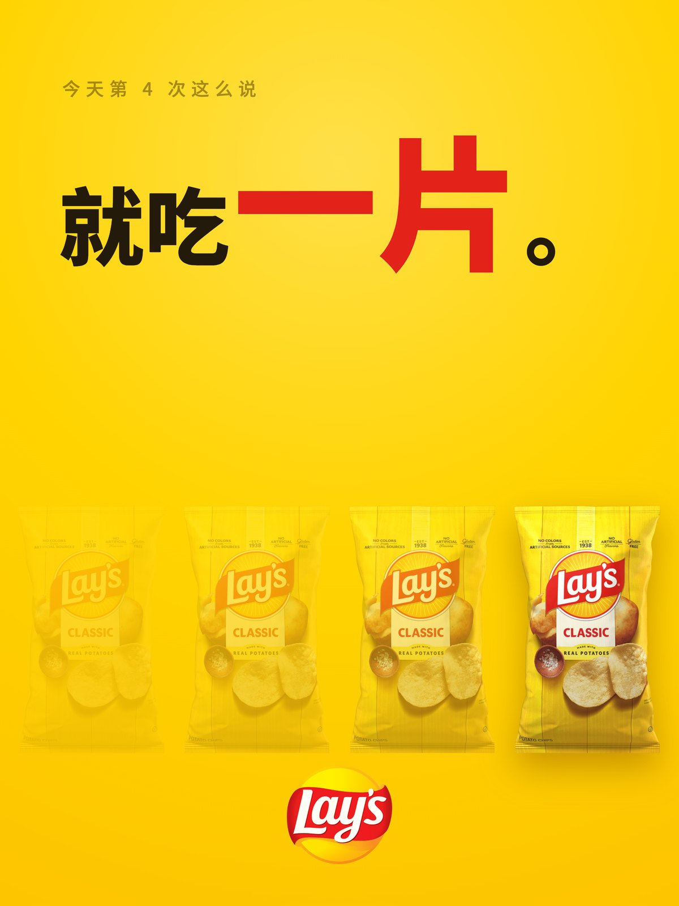
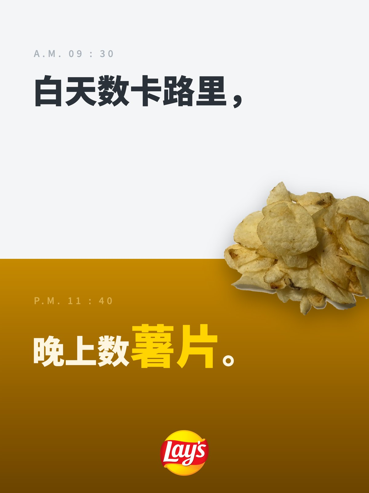

# xiaoma-durex-copywriter

**English** · [Tiếng Việt](README.vi.md)

> A Claude Code / Claude.ai Skill. Produces copy and posters using the **"double-layered meaning + negative space"** method from Durex's golden era on Chinese social media (2011–2017, run by the agency Environment Interactive).

What transfers out of this method is a mechanism for manufacturing the "oh, I get it" moment. Dirty was only the surface material of Durex's category — swap the material for an AI course, careers, personal finance, or fitness, and the mechanism still holds.

<p align="center">
  
  
</p>

> **A note on language.** The method was built in Chinese and the corpus is Chinese. Original lines are kept in Chinese with an English gloss, because the pun *is* the artifact — translate it away and there is nothing left to study. Everything explanatory is in English, and the transfer demonstrations are written as English copy that works in English.

---

## Double-Layered Meaning

A working Durex-style line must **hold up in two contexts at once**.

| Layer | Content |
|---|---|
| **Surface** | The trending topic / holiday / everyday scene itself — it reads literally |
| **Inner** | The brand / product / whatever you're selling |

The writer **only writes the surface layer**; the reader jumps to the inner layer on their own. The kick from that jump is what drives sharing.

The day China Everbright Bank had its trading glitch, Durex posted 「光大是不行的」— "Everbright alone won't do it," where the bank's name literally reads "just big." When the hurdler Liu Xiang fell, it put "fast" and "lasting" side by side and talked, on the surface, only about the athlete. For the Ghost Festival it said five characters: 「今晚早回家」— "come home early tonight."

**Explain it and it dies — that's the iron law.** The moment the copy spells out the inner layer, the line is worthless.

---

## What It Does

Once triggered, the skill runs an **interactive workflow**; it doesn't just hand you one version and call it done.

```
Step 0  Fill the slots — with defaults, not questions
        Only "what are you selling" justifies a question when it can't be inferred;
        every other gap becomes a stated assumption
        "I'm working from 'posting to your own feed, aimed at existing members' — say if that's wrong"

Step 1  Offer 3–5 directions — forced to use different formulas, subject types, palettes
        Three variants of one idea are not allowed

Step 2  The single question — "which direction" and "which ratio" merged into one round,
        both multi-select

Step 3  Write the copy — short copy by default (≤12 Chinese characters);
        long copy only on request. Only short copy ever goes on the poster

Step 4  Make the images — AI generates the still-life subject layer, code does the typesetting
```

> **Why it doesn't ask by default.** Models naturally tend to ask more, and every round of questions spends the user's patience. The user came for output, not to fill in a survey. **One concrete direction with stated assumptions beats three precise questions**, because a user only knows what they want once they see something concrete. The proposal is itself the best way to ask.
>
> This rule came out of running evals. In the first round of testing, the skill would stop and ask even when only one slot was missing, and invented four questions outside the four slots. See [`evals/`](evals/).

---

## Install

```bash
git clone https://github.com/crawfordxx/xiaoma-durex-copywriter.git \
  ~/.claude/skills/xiaoma-durex-copywriter
```

Available the next time Claude Code starts. Trigger phrases: "write me some copy", "ride this trending topic", "holiday poster", "I need a slogan", "how do I promote my course", "write it like Durex".

Install the image-generation parts as needed.

```bash
npm i @napi-rs/canvas      # Canvas typesetting
pip install playwright     # HTML typesetting (either one is enough)
```

---

## Eight Copy Formulas

Full breakdowns, plus transfer demonstrations for non-adult categories, in [`references/copy-formulas.md`](references/copy-formulas.md).

| # | Formula | Durex original | Transferred to an AI course |
|---|---|---|---|
| 1 | Homophone substitution | 「杜du饿了」(Baidu Waimai × Ele.me) | "Prompt and circumstance" |
| 2 | Number pun | 「先来 7 次」("let's do it 7 times first") | "3 hours now buys back 3 years of overtime" |
| 3 | Sense hijacking | 「深耕细作」("deep and careful cultivation") | "Deep learning, shallow usage" |
| 4 | Scene transplant | "The washing machine says…" | "The coffee cup says: he used to refill me five times a night" |
| 5 | Character decomposition | 「『日』字有多长」("how long is the character 日") | 智 = 知 + 日 — **Chinese-specific** |
| 6 | Parallelism / almanac | 「堵在路上 不如堵在床上」("better stuck in bed than stuck in traffic") | "Auspicious: shipping it. Inauspicious: bookmarking it" |
| 7 | Verse | Three stanzas of scenery + one landing line | (long copy only) |
| 8 | **Inverted restraint** | Ghost Festival: 「今晚早回家」("come home early tonight") | "Tools replace tools. They don't replace people who thought it through" |

Formula 8 is the highest grade: **not doing a trick when everyone is waiting for the trick**. A brand that has been cheeky all year suddenly going straight builds character depth instantly. No more than 5 times a year.

---

## Visual System

Reverse-engineered from **260 original posters**; full spec in [`references/visual-system.md`](references/visual-system.md).

### Subject decision tree

```
Is there a physical product?
├─ Yes → can the product be the metaphor itself?
│   ├─ Yes → 【product subject】centered, 15–35% of the frame,
│   │        solid background, strong drop shadow
│   └─ No  → demote it to a corner mark (5–10%); the frame goes to a prop
└─ No (course / knowledge / service) →
    ├─ 【prop subject】 ← most common, and the best fit when there's no product
    │   ⚠️ "No physical product" ≠ "the frame should be empty."
    │      Durex's props are tactile photographed still lifes, not a single line.
    └─ 【type-only subject】big type IS the image
```

Measured split: product ~30% / **prop ~40%** / type-only ~30%. Real people are almost never used; when they are, only a hand, legs, or a silhouette.

### Six palettes

| Name | Primary | Used for |
|---|---|---|
| Brand red | `#E2001A` + pure white | Festivals, statements, anniversaries, attitude |
| Midnight blue | `#16233F` `#0E1A2E` | Restraint, premium feel, night, reflection |
| Studio black | `#000000` + single warm light | Cinematic, suspense, single-product close-ups |
| Pink gradient | `#FCEDF1` → `#E8558F` | Valentine's, women-facing, year-in-review |
| Rice-paper warm white | `#F1EBE0` + vermilion `#C8102E` | Still life, seasonal markers, Chinese-classical, calendars |
| Color-jacking | The other party's brand colors | Collabs; film / sports team / tech newsjacking |

### Layout iron laws

- Copy sits in the **top third or upper left**, left-aligned; the bottom third is negative space or the subject
- Body type ≈ 3.5%–4.5% of frame width; **scale keywords 1.65–1.75× and tint them brand color**, everything else one size and one color
- The eyebrow is 0.6× the body, gray, with letter-spacing
- **The logo is fixed bottom-center and must land on empty space**; the subject may never overlap it
- Negative space ≥ 50%. Crowded = cheap

### Type → [`references/typography.md`](references/typography.md)

**The two that matter most.**

**1. When newsjacking, the typeface follows the thing you're riding, not your brand.** This is the most overlooked part of Durex's type usage. Mimicking an iPhone keynote means PingFang/SF; mimicking a movie poster means a distressed serif plus a handwritten script subhead; mimicking CS:GO means embedding straight into the game UI; mimicking Cultural-Revolution propaganda means old Song set vertically. Readers have muscle memory for these visual languages — **the moment the typeface lands, the surface layer of the double meaning is already complete**, and the copy only has to carry the inner layer.

**2. ⚠️ Chinese font infringement is the single most common legal risk in Chinese marketing collateral.** Microsoft YaHei, PingFang, the Founder (方正) families, and the Hanyi (汉仪) families all require commercial licenses. **"It's on my computer" ≠ "I can use it commercially."** Founder and Hanyi both run dedicated enforcement teams, and claims for a single poster commonly run from thousands to tens of thousands of yuan.

The reference file lists **free commercially usable alternatives** across eight categories (sans / heavy sans / serif / kai / handwriting / Latin sans / script / numeral & mono), plus a licensing red-line list. When in doubt use **Source Han Sans + Source Han Serif** (SIL OFL, commercial use and modification permitted); for headline punch use **Smiley Sans (得意黑)**.

---

## Why Not Let AI Write the Text into the Image

Image models still **mangle Chinese glyphs — wrong characters, missing strokes, broken forms** — and do it unpredictably. The whole point of this visual system is **precise typesetting**.

So the work is split into layers.

```
① AI image model  →  produces ONLY the still-life prop / background texture;
                     the prompt must say NO text
② Code typesetting →  carries all text (Canvas or HTML/CSS)
③ Precise export   →  five formats
```

Chinese never breaks this way, keyword tinting and size multipliers stay exactly controllable, and **changing the copy is a one-line code change — the still-life image is reused, not regenerated**.

How to choose a typesetting approach: [`references/production.md`](references/production.md).

| Approach | When to use |
|---|---|
| **Canvas** (`@napi-rs/canvas`) | Default; especially **graphic arrays** (the screen-filling icon matrices of the tear-off-calendar layout), where generating programmatically beats placing by hand |
| **HTML/CSS + Playwright** | Complex layouts; when you want to tune it WYSIWYG |
| **Satori + resvg** | Server-side batches, when you don't want to install a browser |

---

## Examples

`examples/output/` holds two posters made with this skill for Lay's — same brand, two completely different skeletons.

|  |  |
|---|---|
| **「就吃一片。」** "Just one chip."<br>Eyebrow: "4th time saying that today" | **「白天数卡路里，晚上数薯片。」** "Count calories by day, count chips by night."<br>Eyebrow: A.M. 09:30 / P.M. 11:40 |
| Sense hijacking · product-subject array | Parallelism · split-frame day/night |

On the left, the copy is just something you say to yourself, with four bags fanned out below from faint to solid. Said it four times, opened four bags. The "4" in the eyebrow matches the four bags in the frame — the reader lands in one hop, no reasoning required.

On the right, parallelism, with the frame cut through the middle. The cold white top half is daytime, the dark amber bottom is night, and a chip falls across the dividing line — that's exactly how the daytime half's effort disappears.

Both obey the same hard rules: copy ≤ 12 characters, keyword scaled 1.7× and tinted brand red, negative space ≥ 50%, logo fixed bottom-center and never overlapped by the subject. The palette is **color-jacking** in both cases, using Lay's own yellow and red rather than picking from the six schemes. When working for a specific brand, color-jacking is always the first choice.

All assets are real. The packaging is the official packshot from the Lay's site, the logo is from Wikimedia Commons, and the type is Source Han Sans (SIL OFL, commercially usable). **Do not fabricate fake packaging.**

`examples/durex-reference/` holds 24 low-resolution samples of original Durex posters, for studying the layout patterns by comparison (see the copyright notice below).

---

## Directory Structure

```
.
├── SKILL.md                      # Main file: mechanism, workflow, formula reference, boundaries
├── references/
│   ├── corpus.md                 # Corpus (34 sources / 260 posters)
│   ├── vietnam-market.md         # Vietnam market pack: Vietnamese corpus, Formula-5 replacements, trend calendar, red lines, type
│   ├── copy-formulas.md          # The 8 formulas in detail + transfer templates
│   ├── visual-system.md          # Full visual system spec
│   ├── typography.md             # Type selection + licensing red lines
│   ├── ratios.md                 # Composition specs for the five formats
│   ├── production.md             # Image pipeline and approach selection
│   └── other-uses.md             # Transfer contexts
├── evals/                        # Test cases and assertions (the skill's behavior is tested)
├── assets/
│   ├── compose_canvas.js         # Canvas composition (with signature clearance)
│   ├── compose_example.py        # HTML/Playwright composition
│   └── gen_hero_example.py       # Still-life generation
└── examples/
    ├── output/                   # Finished work made with this skill
    ├── durex-reference/          # Low-res samples of the originals (China)
    └── durex-vietnam-reference/  # Vietnam-market ad catalog (12 documented samples + image fetch script)
```

---

## Where Else It Works

See [`references/other-uses.md`](references/other-uses.md), which covers social media headlines and covers, paid knowledge, B2B SaaS (hijacking industry jargon), e-commerce product pages (letting the objects next to the product speak), job descriptions, personal brand, and seasonal-calendar series assets.

That file also lists the contexts **where this doesn't transfer**, including heavily regulated categories, crisis communications, audiences with low internet-culture fluency, and large B2B purchasing.

---

## What to Do and What Never to Do

Durex's 2017 "419 collab" blew up in its face and it subsequently lost Environment Interactive; the root cause was crossing line 3. The skill encodes these five as hard boundaries.

1. Never touch disasters, accidents, death, or illness, unless it is an explicit public-service stance
2. Never objectify women
3. **Never make sexual innuendo about identifiable real people**, and absolutely never involving minors
4. Never ride on grief
5. When transferring to non-adult categories, the inner layer of the pun should point at **product value**, not at a dirty joke

---

## Copyright and Disclaimer

- The posters in `examples/durex-reference/` are **copyright Durex / Reckitt Benckiser**. Only 24 samples are included here, compressed to under 800px, for **study and commentary** on advertising creative method, not for any commercial use.
- The corpus and cases were compiled from public sources including Digitaling, Uisdc, Adquan, Meihua, and Zhihu. **Copyright remains with the original authors and publishing platforms.**
- This repository has **no affiliation or partnership** with Durex / Reckitt Benckiser.
- If a rights holder objects, please open an issue and it will be removed immediately.
- The code (`assets/`) is provided under the MIT license.

---

## Acknowledgements

The methodology originates with **Environment Interactive** and **Jin Pengyuan**'s team, 2011–2017. 16,938 posts over 6 years, averaging 8 a day. The formulas grew out of that volume — **sustained high-quality output comes first; only then are there formulas to extract**.
